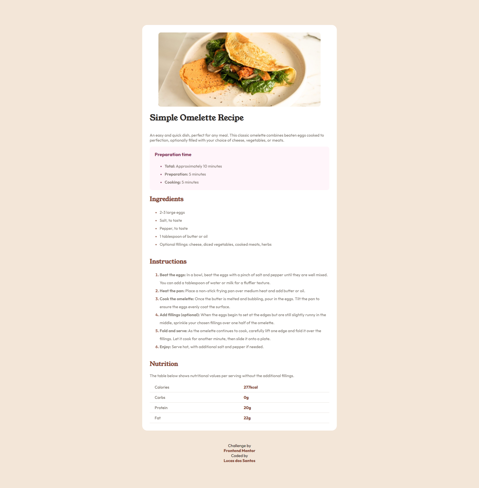

# Frontend Mentor - Recipe page solution

This is a solution to the [Recipe page challenge on Frontend Mentor](https://www.frontendmentor.io/challenges/recipe-page-KiTsR8QQKm). Frontend Mentor challenges help you improve your coding skills by building realistic projects.

## Table of contents

- [Overview](#overview)
  - [Links](#links)
  - [Built with](#built-with)
  - [Screenshot](#screenshot)

## Overview

### Links

- Solution URL: [github](https://github.com/lucas0013/recipe-page-main)
- Live Site URL: [page](https://lucas0013.github.io/recipe-page-main/)

### Built with

- Semantic HTML5 markup
- Sass

### Screenshot

